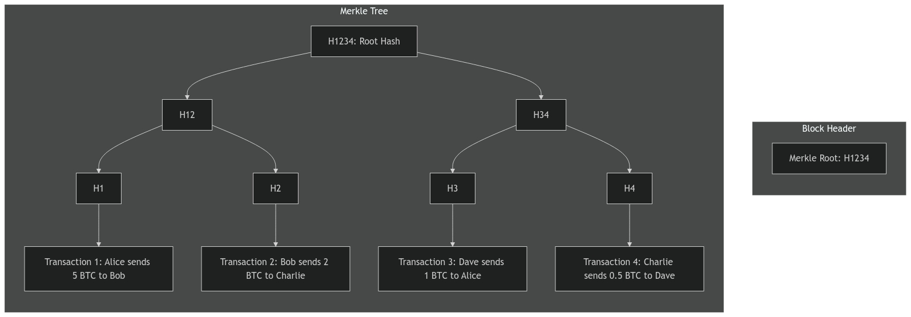
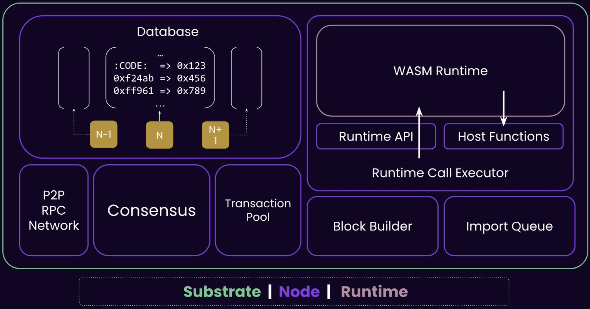
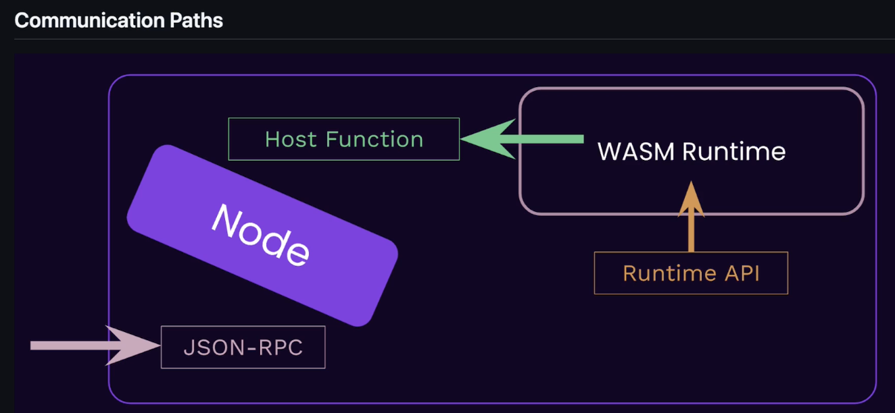

# 1. Cryptography
## 1.1 Kerckhoff's Principle:
A cryptographic system should be secure even if everything about the system, except the key, is public knowledge.

## 1.2 Hashing attacks
* **Preimage Attack**: Given a hash value h, find any message m such that `hash(m) = h`. Trying to find an input that produces a specific target hash
* **Weak Collision Attack (Second Preimage Attack)**: Given a message `m1`, find another message `m2` such that `hash(m1) = hash(m2)`.
* **Strong Collision Attack**: Find any two different messages `m1` and `m2` such that hash(m1) = hash(m2). Can use any two inputs, not tied to a specific input or hash.

## 1.3 Encryption
* Symmetric key encryption is less computationally expensive, so faster, than asymmetric key encryption. 
* So we try to share the symmetric keys securely and then use them for communication. 2 ways to share keys:
    * **Diffie Hellman key exchange**: Both parties involved create unique secret keys. Then they share a common `base` and `modulus` and use modular arithmetic to calculate a shared secret key.
    * **Asymmetric Key Encryption (RSA)**: Here both parties create separate public and private keys. The public key is shared with the other party and the private key is kept secret. Both parties use this secure channel to share a symmetric key.

## 1.4 Wallet and Accounts
* A crypto wallet doesn't store any crypto assets. It stores the private keys which prove ownership of the crypto assets.
* The public key is the wallet address.
* Pneumonic phrases are a way to generate a private key from a random string of words.
* We can't remember a `2048` bit private key, so we use a pass phrase to generate it. The magic here is that we change the base of the private key from `2` to `58` (in case of polkadot) so that the private keys becomes shorter and is easy to remember.
* The specific address format used in polkadot is `SS58` format. `SS58` is a base58 encoding of the public key and it adds `2` bytes at the beginning to "indicate the network". It also adds `2` bytes at the end for `Checksum`.
* **Hard Derived Account**: Has it's own private key and public key. Created with `\\` (2 slashes).
* **Soft Derived Account**: Has it's own public key and shares the private key with the parent account. Created with `/` (1 slash).

## 1.5 Digital Signatures
* A digital signature is a mathematical scheme for verifying the authenticity of a digital message or document.
* Guaranteed properties of a Digital Signature scheme in the context of transactions:
    * **Authenticity**: a valid signature implies that the signer deliberately signed the transaction.
    * **Unforgeability**: it is computationally infeasible to forge a signature without knowledge of the private key.
    * **Non-repudiation**: the signer cannot later deny having signed the message
    * **Integrity**: ensure the transaction data has not been modified
* It consists of 3 algorithms:
    * **Key Generation**: Generate a public and private key pair.
    * **Signing Algorithm**: Uses the private key and the message to create a signature.
    * **Verification Algorithm**: Uses the public key and the original message and the signature to verify if the signature is valid. The signature will only verify correctly if the message hasn't been tampered with and the public key corresponds to the private key that was used to create the signature.
* **In Practice** digital signatures don't sign the entire message. Instead a hash function is used to hash the message and create a `Digest` or `Fingerprint` of fixed length. The reason for this is that Cryptographic hashing functions usually work on fixed size inputs.
* One challenge that Digital signatures address is `Replay Attacks`. A replay attack is when an attacker captures a message and then later re-sends it to the recipient. The recipient can't tell if the message is new or old. To prevent this, Digital signatures often use additional information like `nonces` and `timestamps`/`lifetimes`.
* **Multisig accounts** are accounts that require multiple signatures to authorize a transaction. This is useful for things like other decentralized organizations.

## 1.6 Hash Based Data Structures

### 1.6.1 Hash Chains
* A hash chain is a fundamental data structure used in blockchains to ensure the integrity and immutability of data. It is a sequence of blocks (objects), each containing data and a cryptographic hash of the previous block, forming a chain (could be anything like vector or list). This structure ensures that any alteration in a block would require changes to all subsequent blocks, making it tamper-evident.
* Most blockchain implementations (including major ones like Bitcoin) store blocks in a database or vector and use the hash values for validation, not traversal.

### 1.6.2 Merkle Trees
* Merkle tree also known as hash tree is a data structure used for data verification and synchronization. 
* It is a tree data structure where each non-leaf node is a hash of it’s child nodes. All the leaf nodes are at the same depth and are as far left as possible. 
* Each transaction gets hashed, Hashes are paired and hashed again, Process repeats until single root hash, Root hash goes in block header of the blockchain block.

### 1.6.3 Merkle Mountain Range
* A Merkle Mountain Range (MMR) is a variation of Merkle Trees that allows efficient appending of new elements. Think of it as a collection of perfect binary trees of different heights, forming a "mountain range" profile.
* Efficient appending O(log n), Easy to prove membership, Good for growing datasets, Used in blockchain UTXO sets.

* MMR provides a way for blockchain UTXO management. When new transaction creates UTXOs:
    * Hash the new UTXOs
    * Add to MMR structure
    * Update peaks if needed
* When spending UTXOs:
    * Prove UTXO exists using MMR path
    * Remove spent UTXO
    * Add new UTXOs from transaction

### 1.6.4 Radix/Patricia Tries
* A Patricia Trie (Practical Algorithm To Retrieve Information Coded In Alphanumeric) is a modified trie that compresses nodes with only one child, making it more space-efficient. In blockchains, it's used to store state data efficiently.

## 1.7 Advanced Cryptography Topics

### 1.7.1 Shamir Secret Sharing
* Shamir Secret Sharing is a cryptographic method to split a secret into n shares, where any k shares (threshold) can reconstruct the secret, but k-1 or fewer shares reveal nothing about the secret.

### 1.7.2 Verifiable Random Functions (VRFs)
A VRF is a cryptographic function that:
* Takes an input and private key to generate a random number
* Provides a proof that the number was generated correctly
* Anyone can verify the proof using the public key
* Same input + private key always gives same output
* Output appears random to anyone without the private key

### 1.7.3 Zero-Knowledge Proofs (ZKPs)
* A zero knowledge proof is a method where one party (prover) can prove to another party (verifier) that a statement is true without revealing any information beyond the validity of the statement.

# 2. Fundamentals of blockchains

## 2.1 Blockchain Concepts Pre-Quiz:
* Bitcoin uses `UTXO` model instead of the `Accounts` model to process transactions.
* Typically, The hash of the NFT images and videos is stored on the blockchain network. The original content is stored typically on a decentralized storage platform which may or may not use blockchain technology stack. Storing them directly on the blocks or in the blockchain state can be expensive and is an inefficient implementation of the NFT use case.
* Just because the transaction shows up on Bitcoin block explorers does not mean the transaction is final. The finality of the Bitcoin blockchain is probabilistic. That is why central exchanges wait a couple of hours before letting you transact with the Bitcoin you deposited on their platform.
* The security guarantees offered by Ethereum Roll-ups (Layer 2 chains) are **NOT** the same as the security guarantees of the Ethereum network (Layer 1 chain).
* Blockchain network's security and resilience to attacks rely on factors like decentralization, consensus mechanisms, and protocol design.

## 2.2 Blockchain Networks:

### 2.2.1 Types of Decentralization
* **Architectural Decentralization**: To address single point of failures in the network (Distributed systems)
* **Political Decentralization**: Who gets to decide how the blockchain should operate? What is the governance model?
* **Logical Decentralization**: Blockchains may be politically decentralized (no one controls them) and architecturally decentralized (no infrastructural central point of failure) but they are logically centralized. There is one commonly agreed state and the system behaves like a single computer. Most blockchains are logically centralized.

## 2.3 Blockchain Architecture
* Blockchain architecture consists of multiple layers, each with specific functions:
    * **Application Layer**: Top-most layer where users interact with blockchain. Includes dApps, smart contracts, wallets, and user interfaces. Provides services and functionality to end users
    * **Consensus Layer**: Ensures all nodes agree on the state of the blockchain. Implements consensus mechanisms (PoW, PoS, etc.). Validates and orders transactions
    * **Network Layer**: Handles peer-to-peer communication between nodes. Manages transaction and block propagation. Maintains network connectivity and node discovery
    * **Data Layer**: Defines structure of blockchain data (blocks, transactions). Implements cryptographic primitives and data structures. Handles data storage and retrieval
    * **Infrastructure Layer**: Base layer providing hardware and software requirements. Includes nodes, physical networks, and computing resources. Supports basic blockchain operations

* Different **types of blockchain architectures**:

* Layers in Blockchain Ecosystem Architecture:
    * **Layer 0**: Network infrastructure protocols that allow blockchains to be built and communicate
        * Not a blockchain itself
        * A foundation layer/protocol
        * Example: Polkadot isn't a blockchain, it's a protocol that allows creation and connection of blockchains (parachains)
    * **Layer 1**: Actual base blockchains
        * These ARE blockchains
        * Independent networks with their own consensus
        * Example: Ethereum is a L1 blockchain
    * **Layer 2**: Scaling solutions built ON TOP of L1 blockchains
        * Not independent blockchains
        * Solutions that extend L1 capabilities
        * Example: Optimism isn't its own blockchain, it's a scaling solution for Ethereum

## 2.4 Blockchain Trilemma
* The Blockchain Trilemma refers to the fundamental challenge in blockchain design where it's seemingly impossible to achieve all three key properties simultaneously:
    * Decentralization
    * Security
    * Scalability

## 2.5 Blockchain Consensus

### 2.5.1 Layers of Consensus
These are used in consensus mechanisms to filter out chains until we find the canonical chain.
* **State Machine Validity**: This checks if the history of transaction (`State Transitions`) are valid.
* **Political Validity**: We might reject blocks that don't meet certain `political` or `arbitrary` rules. For example, in Bitcoin, blocks bigger than 1MB are rejected.
* **Right to Author**: This checks if the block was authored by the right person who was elected to author the block.
* **Fork Choice**: Each node has its own view of the blockchain and decides, based on that, if the current block is valid or not. A block in an invalid fork would be rejected.

### 2.5.2 Consensus Mechanisms
* **Proof of Work (PoW)**: 
    * It is a `permissionless` consensus mechanism that requires miners to solve complex mathematical problems to validate transactions and add new blocks to the blockchain. It ties the blockchain's value to a real world scarce resource (energy).
    * Downsides: It is energy-intensive and the blocks are produced at varying times.
* **Proof of Stake (PoS)**:
    * A consensus mechanism where validators stake (lock up) cryptocurrency to get the right to validate blocks. The more you stake, the higher chance of being selected to validate.
* **NOTE**: `PoW` and `PoS` are mechanisms for `block authoring`. Consensus on `block finality` is achieved through finality gadgets like `GRANDPA` for deterministic block finality.

### 2.5.3 Block Finality Mechanisms

* **Block Finality**: The guarantee that a block cannot be reverted/changed once added to the chain.
* **Finality Gadgets**: These are mechanisms that allow a blockchain to reach `Deterministic Finality`. In Polkadot, the primary finality gadget is `GRANDPA`(GHOST-based Recursive Ancestor Deriving Prefix Agreement).

#### 2.5.3.1 Probabilistic Finality
* Finality becomes stronger over time. More blocks = more certainty. Used in BTC.
* There is always a risk of reverting a block if a longer chain is found.

#### 2.5.3.2 Deterministic Finality
* Finality is guaranteed. Once confirmed, block cannot be reverted. Used in PoS systems like Polkadot. Example: After 2/3 validators sign, block is final.
* There is no risk of reverting a block.

#### 2.5.3.3 GRANDPA
* GRANDPA is responsible for finalising blocks in polkadot.
* Polkadot uses a two-phase voting system (`Hybrid Consensus Model`) to reach finality. It separates the block production from block finality.

### 2.5.4 Forks in Blockchain
* **Soft Fork**: A change to the protocol that is backward compatible. Tightens/adds rules. Old nodes can still validate blocks.
* **Hard Fork**: A change to the protocol that is not backward compatible. Changes fundamental rules. Old nodes will reject new blocks.

# 3. Polkadot
## 3.1 Blockchain
A blockchain is, in its essence, a distributed and decentralized key-value database. The principle of a blockchain is to make it possible for any participant to perform modifications to this database, and for all participants to eventually agree on the current state of said database.

In Polkadot and Substrate-compatible chains, the state of this database is referred to as "the storage". The storage can be seen more or less as a very large HashMap.

A blockchain therefore consists in three main things:
1. The initial state of the storage at the moment when the blockchain starts
2. A list of blocks, where each block represents a group of modifications performed to the storage
3. A peer-to-peer network of clients connected to each other and exchanging information such as newly-produced blocks

Blocks are built on top of each other, forming a sequential list of modifications to the storage on top of its initial state.

## 3.2 Polkadot Architecture

Polkadot is a heterogeneous multichain with shared security and interoperability.

### 3.2.1 Relay Chain - A Layer 0 Blockchain
The Relay Chain is the central chain of Polkadot. The Relay Chain has deliberately minimal functionality - for instance, smart contracts are not supported. The main responsibility is to coordinate the system as a whole, including parachains. Other specific work is delegated to the parachains, which have different implementations and features.

### 3.2.2 Parachains and Parathreads
Polkadot can support a number of execution slots. These slots are like cores on a computer's processor (a modern laptop's processor may have eight cores, for example). Each one of these cores can run one process at a time. 

Polkadot allows these slots using two subscription models:
- **Parachains**: Have a dedicated slot (core) for their chain and are like a process that runs constantly
- **Parathreads**: Share slots amongst a group, and are thus more like processes that need to be woken up and run less frequently

### 3.2.3 Validator
Validators are the Relay chain nodes that, if elected to the validator set, produce blocks on the Relay Chain. They are incentivized to act in the best interests of the network through rewards.

### 3.2.4 Collator
Collators are full nodes on both a parachain and the Relay Chain. They:
- Collect parachain transactions
- Produce state transition proofs for the validators on the Relay Chain
- Can send and receive messages from other parachains
- Maintain a full node of the parachain
- Retain all necessary information of the parachain
- Produce new block candidates to pass to the Relay Chain validators for verification and inclusion in the shared state of Polkadot

### 3.2.5 Bridges
A blockchain bridge is a connection that allows for arbitrary data to transfer from one network to another. These chains are interoperable through the bridge but can exist as standalone chains with different protocols, rules, and governance models. 

In Polkadot, bridges:
- Connect to the Relay Chain
- Are secured through the Polkadot consensus mechanism
- Are maintained by collators

# 4. Polkadot SDK
## 4.1 Polkadot SDK Overview
* **Polkadot SDK**: A collection of tools and libraries that help developers build applications on the Polkadot network.
* **Polkadot SDK Components**: The SDK has 3 main components:
  * **`Substrate`**: A framework for building blockchains. This is the foundational framework of Polkadot SDK. It includes core components like networking, transaction pools and APIs.
  * **`FRAME`**: A collection of modules that provide common functionality for building blockchain applications. This is built on top of Substrate and defines the Application logic of the blockchain.
  * **`Cumulus`**: This is a lighter layer in the SDK which enables `substrate` based chains to be compatible with Polkadot.
* **`ZombieNet`**: It helps simulate a relay chain and parachain node setup on a local machine for testing the features and functionalities of a parachain (end-to-end testing for parachains on a local machine).
* **`Chopsticks`**: Chopsticks is a tool that can be used to test blockchain runtime. It simulates just the relay chain and parachain runtimes without running the nodes and can be used for testing runtime features. Chopsticks is a versatile, light weight testing tool for cross-chain functionality in the Polkadot ecosystem. Chopsticks tooling can be used to test cross-chain functionalities between Polkadot and parachains, as well as the functionalities between different parachains.

## 4.2 Substrate (PolkadotSDK's blockchain building framework)
* **Substrate**: A framework for building blockchains. It provides a set of tools and libraries for building blockchains, including networking, transaction pools, APIs, and other core components. It is mostly un-opinionated and allows developers to build their own blockchain applications. It has the following features:
  * **Modularity**: Substrate is modular, allowing developers to choose which components they want to use and build their blockchain on top of it.
  * **Flexibility**/**Extensibility**: Substrate is extensible and customizable, allowing developers to add their own functionality to the blockchain.
  * **Upgradability**: Substrate is designed to be upgradable, allowing developers to upgrade their blockchain without downtime. The forkless and seamless upgrades are a distinctive feature of the Polkadot SDK.

### 4.2.1 Substrate Wasm Meta Protocol

* **Meta Protocol**: A meta protocol is a protocol that defines rules for creating and modifying other protocols. In the context of `Polkadot` and `Substrate`, the `Substrate Wasm Meta Protocol` refers to a mechanism for `defining`, `updating`, and `executing` the logic that governs the blockchain runtime.
* **Wasm**: WebAssembly (Wasm) is a lightweight, platform-agnostic binary instruction format designed for high-performance applications. It allows code written in languages like Rust, C++, or Go to run in web browsers and other environments, including blockchains. It is a portable, efficient runtime execution environment.
* **Substrate Wasm Meta Protocol**: The Substrate Wasm Meta Protocol describes the dynamic, modular architecture in Substrate and Polkadot, where:
  * Blockchain Runtime:
    1. Encapsulated in a Wasm binary.
    2. Contains all the business logic, including consensus mechanisms, transaction validation rules, and governance processes.
  * Runtime Upgrades:
    1. Instead of requiring hard forks, the runtime logic can be upgraded on-chain by submitting a new Wasm binary.
    2. The meta protocol defines the process for proposing, validating, and deploying these upgrades.
  * Chain Flexibility:
    1. Because the runtime is abstracted, a single chain can evolve its behavior over time. This enables rapid development and adaptation to new use cases or requirements.

